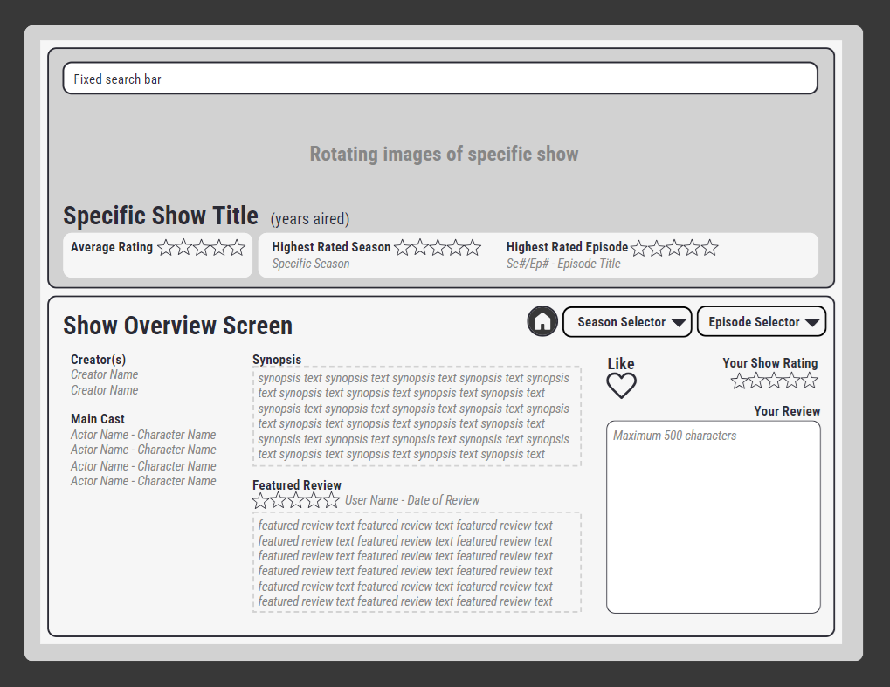

# Wireframes

## Home Page

this is the home page of our application where users will be able to see a selection of TV shows in a categorized rows based on genres. Square boxes with
X's are going to be the show's image. There is a search bar at the top of the screen for users to search for a show they want to review or look at reviews. 
There are also Register and Login links at the top of the page for users who want to create an account and make reviews themselves.

## Show-Specific Pages

This collection of three wireframes represent the same screen. When a specific show is selected, the show's "home page" will displace the show's name and the
years it was aired. However, there will be three key differences within the show's embedded format.

3.0 Provides the user with overall information for the show such as the creator(s), main cast, and an overall synopsis

3.1 Provides the user with seasons-specific information

3.2 Provides the user with episode specific information, such as the director(s), main cast, the writer(s) and a synopsis of that specific episode

The shared functionality is that each of these embedded pages will allow the user to review another user's review/rating, add a review/rating, click the 
heart to mark the show as a favorite.

## Search Results Page

This is the search screen of our application. The initial results will be a mix of top results from all categories. The search bar will be in the top left corner. Below it will be the search termed entered, if the typed value is misspelled an alternative will be offered beneath. To the right is a filter that will allow users to specify their results. In the top right corner, the user can login or create an account

